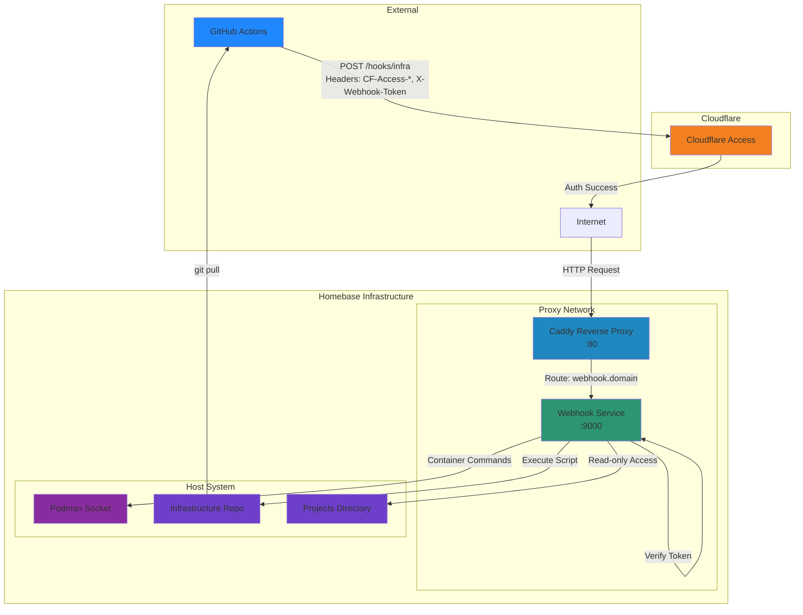

# homebase-infra

A self-hosted infrastructure setup for managing services with automatic deployment via webhooks. This setup uses Podman for container orchestration, Caddy as a reverse proxy, and GitHub Actions for CI/CD.

## Features

- **Automatic Deployment**: GitHub Actions triggers webhook for zero-downtime deployments
- **Reverse Proxy**: Caddy handles routing and compression
- **Security**: Cloudflare Access protection for webhook endpoints
- **Container Management**: Podman for rootless container execution
- **Lightweight**: Minimal resource footprint with Alpine-based images

## Environment Requirements

### System Requirements

- Linux-based OS (tested on Ubuntu)
- Podman 4.7+ ([Why Podman over Docker?](https://docs.podman.io/en/latest/Introduction.html#podman-vs-docker))
- Podman Compose 1.3+ ([Run compose workloads via an external provider such as docker-compose or podman-compose](https://docs.podman.io/en/v5.6.2/markdown/podman-compose.1.html))
- Podman-compose ([Run docker-compose.yml using podman](https://github.com/containers/podman-compose))

- Git 2.0+

### Network Requirements

- Domain name with DNS configured
- Cloudflare account (for Access protection)
- Ports available:
  - `80` (HTTP) - or custom port via `CADDY_HTTP_PORT`

### Installing Podman


**Ubuntu/Debian:**
```bash
sudo apt update
sudo apt install podman podman-compose
```

For other distributions, see the [official Podman installation guide](https://podman.io/getting-started/installation).

## Setup Instructions

### 1. Clone the Repository

```bash
git clone https://github.com/yourusername/homebase-infra.git
cd homebase-infra
```

### 2. Configure Environment Variables

Copy the example environment file and customize it:

```bash
cp .env.example .env
```

Edit `.env` with your configuration:

```env
# Your domain name
DOMAIN=yourdomain.com

# Path to your projects directory
PROJECTS_DIR=/home/youruser/projects

# Port for Caddy (default: 8080)
CADDY_HTTP_PORT=8080

# Secret token for webhook authentication
WEBHOOK_TOKEN=your-secure-random-token
```

### 3. Create External Network

Create the external proxy network that services will use:

```bash
podman network create proxy
```

### 4. Start Services

Start the infrastructure using Podman Compose:

```bash
podman-compose up -d
```

Verify services are running:

```bash
podman ps
```

You should see both `caddy` and `webhook` containers running.

### 5. Configure GitHub Actions

Set up the following secrets in your GitHub repository:

- `WEBHOOK_TOKEN`: Same token from your `.env` file
- `CF_ACCESS_CLIENT_ID`: Cloudflare Access client ID
- `CF_ACCESS_CLIENT_SECRET`: Cloudflare Access client secret

Set the following variable:

- `DOMAIN`: Your domain name

### 6. Configure Cloudflare Access

1. Create a Cloudflare Access application for `webhook.yourdomain.com`
2. Generate a service token for GitHub Actions
3. Add the service token credentials to GitHub secrets

## Network Architecture



### Architecture Components

1. **GitHub Actions**: Triggers deployment on push to main branch
2. **Cloudflare Access**: Authenticates and authorizes webhook requests
3. **Caddy**: Reverse proxy that routes `webhook.domain` to webhook service
4. **Webhook Service**: Receives deployment triggers and executes update scripts via Docker CLI (which communicates with Podman socket)
5. **Podman**: Manages containers and provides Docker-compatible socket for container operations
6. **Infrastructure Repo**: Git repository containing infrastructure configuration
7. **Projects Directory**: Read-only access to application projects

### Request Flow

1. Developer pushes code to `main` branch
2. GitHub Actions workflow triggers
3. Workflow sends POST request with Cloudflare Access headers and webhook token
4. Cloudflare Access validates service token
5. Request reaches Caddy reverse proxy
6. Caddy routes to webhook service based on subdomain
7. Webhook verifies `X-Webhook-Token` header
8. Webhook executes `update-infra.sh` script
9. Script pulls latest code and restarts affected services
10. Deployment complete

### Docker CLI Compatibility

The webhook service uses Docker CLI commands internally, but these actually operate on the Podman socket. This is possible because:

1. **Podman provides Docker-compatible API**: Podman's socket implements the same API as Docker
2. **Socket mounting in `compose.yml`**:
   ```yaml
   volumes:
     - ${XDG_RUNTIME_DIR}/podman/podman.sock:/var/run/docker.sock
   ```
   The Podman socket is mounted at the standard Docker socket path

3. **No Docker installation required**: Even though scripts use `docker` commands, only Podman needs to be installed on the host

This design allows:
- Using standard Docker-based tools and scripts without modification
- Maintaining compatibility with existing Docker workflows
- Benefiting from Podman's security advantages (rootless, daemonless)

**Example**: In `update-infra.sh`, the command `docker restart caddy` actually executes through the Podman socket, restarting the Podman-managed container.

## Usage

### Manual Deployment

To manually trigger an infrastructure update:

```bash
curl -X POST https://webhook.yourdomain.com/hooks/infra \
  -H "X-Webhook-Token: your-token" \
  -H "CF-Access-Client-Id: your-id" \
  -H "CF-Access-Client-Secret: your-secret" \
  -H "Content-Type: application/json" \
  -d '{}'
```

### Viewing Logs

View logs for all services:

```bash
podman-compose logs -f
```

View logs for a specific service:

```bash
podman logs -f caddy
podman logs -f webhook
```

### Restarting Services

Restart all services:

```bash
podman compose restart
```

Restart a specific service:

```bash
podman restart caddy
```

### Stopping Services

Stop all services:

```bash
podman compose down
```

Stop but keep volumes:

```bash
podman compose stop
```

## Troubleshooting

### Podman Socket Not Found

If you get a socket error, ensure Podman socket is enabled:

```bash
systemctl --user enable --now podman.socket
systemctl --user status podman.socket
```

Verify the socket path:

```bash
echo $XDG_RUNTIME_DIR/podman/podman.sock
```

### Network Not Found

Create the external proxy network:

```bash
podman network create proxy
```

### Webhook Not Triggering

1. Check webhook logs: `podman logs webhook`
2. Verify `WEBHOOK_TOKEN` matches in `.env` and GitHub secrets
3. Test webhook endpoint accessibility
4. Check Cloudflare Access configuration

## Podman vs Docker

This project uses **Podman** instead of Docker for several advantages:

- **Rootless Containers**: Better security with no daemon running as root
- **Daemonless**: No background service required
- **Docker-Compatible**: Drop-in replacement for Docker CLI
- **Systemd Integration**: Native integration with systemd for service management

For a detailed comparison, see the [official Podman documentation](https://docs.podman.io/en/latest/Introduction.html#podman-vs-docker).

## Project Structure

```
homebase-infra/
├── caddy/
│   └── Caddyfile           # Caddy reverse proxy configuration
├── webhooks/
│   ├── Dockerfile
│   ├── hooks.json          # Webhook endpoint definitions
│   └── scripts/
│       └── update-infra.sh # Infrastructure update script
├── .github/
│   └── workflows/
│       └── deploy.yml
├── compose.yml             # Podman Compose service definitions
├── .env.example            # Example environment variables
└── README.md
```